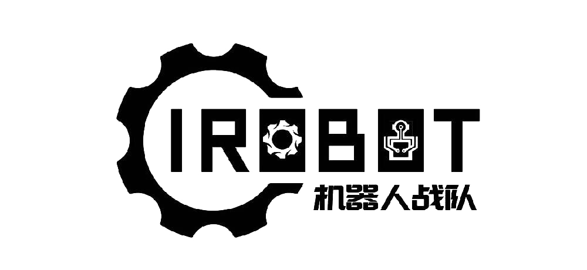

    

<h3 align="center">欢迎报名 IRobot 战队算法组！</h3>

### 2025 赛季算法组预备队员**git学习**文档，**部分任务考核需在此提交**。
- git学习教程：https://www.liaoxuefeng.com/wiki/896043488029600
- 代码和提交规范：https://github.com/IRobot-Algorithm/CODE_STANDARD

### 提交方式
在 Welcome/submissions/ 中创建一个自己名字的文件夹提交任务,一个任务用一个文件夹或者一个文件

### 考核进度跟踪
todo

### 任务目录

-todo

